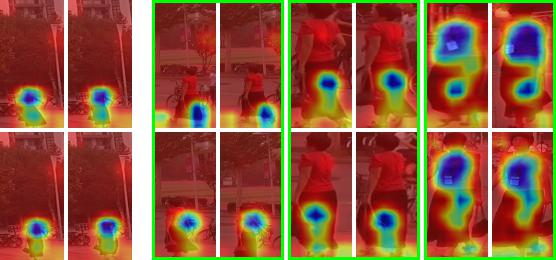
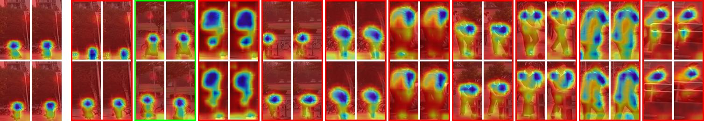

## VPReID
video person re-identification 

## 环境安装  
参考 https://github.com/JDAI-CV/fast-reid  
```shell script
conda create -n fastreid python=3.7
conda activate fastreid
conda install pytorch==1.6.0 torchvision tensorboard -c pytorch
```
## next  
- 数据集结构 
- GCM消融实验

##  baseline指标

|      Datasets  (R1/mAP)    | baseline      |   
|      :----------------:    | :-----------: | 
| prid (split_id=9)          |    94.4/--    | 
| ilids (split_id=9)         |    87.3/--    | 
|        Mars                |    88.9/83.4  |  
|       DukeV                |    95.9/95.3  |   
|       LSVID                |    81.5/72.1  |   
------------------------------------------------
## 我的模型 GCM
- GemMe
- CoordAtt3D
- MultiLoss 
 
|      Datasets  (R1/mAP)    | GCM           |   
|      :----------------:    | :-----------: | 
|        Mars                |    **90.2/85.4**  | 
|       LSVID                |               | 
|       DukeV                |               |   
| prid (split_id=9)          |     92.1          | 
| ilids (split_id=9)         |     86.0          | 
------------------------------------------------- 
## 可视化Demo  
- gt demo  

   

- res demo  

    

## Mars Test Log

    Loading checkpoint from 'Mars_new_integrate0231/checkpoint_ep220.pth.tar'  
    Evaluate  
    1000/1980  
    Extracted features for query set, obtained torch.Size([1980, 2048]) matrix  
    1000/9330  
    2000/9330  
    3000/9330  
    4000/9330  
    5000/9330  
    6000/9330  
    7000/9330  
    8000/9330  
    9000/9330  
    Extracted features for gallery set, obtained torch.Size([11310, 2048]) matrix  
    Extracting features complete in 62m 48s  
    Computing distance matrix  
    Computing CMC and mAP  
    ori Results ----------  
    top1:90.2% top5:97.1% top10:98.0% mAP:85.4%  
    re Results ----------  
    top1:94.4% top5:98.0% top10:98.6% mAP:88.5%
